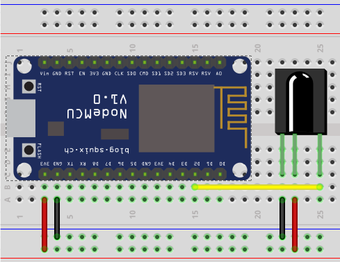
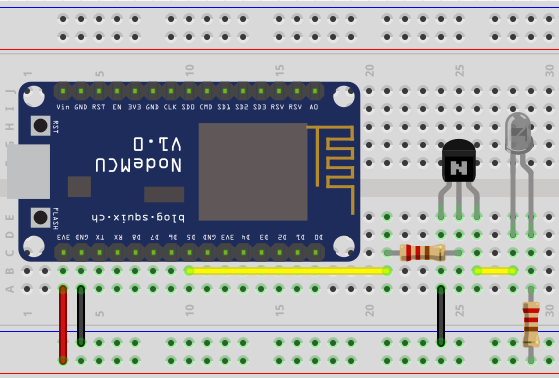

esp-ir
======

Library for [ESP-OPEN-RTOS](https://github.com/SuperHouse/esp-open-rtos) to send and receive IR commands.

Receiving IR codes can be done on arbitrary pin (which supports GPIO mode and pin change interrupts),



(big black thing being IR decoder, e.g. TSOP38238. Consult datasheet on particular part pinout).

Transmission though can only be done on GPIO14:



(pretty much any NPN transistor will do, e.g. 2N2222; transistor base resistor could be 10K Om; LED resistor is calculated based on LED parameters, but you probably safe by assuming it can handle 10-20mA and go with ~220 Om).


Example sending command:
```c
#include <ir/ir.h>
#include <ir/raw.h>

static int16_t[] command1 = {
  3291, -1611,
  443,  -370,   425,  -421,   421, -1185,   424,  -422,
  421, -1185,   425,  -421,   421,  -370,   424,  -392,
  448, -1188,   423, -1214,   444,  -372,   422,  -395,
  447,  -397,   420, -1186,   449, -1185,   424,  -423,
  419,  -375,   441,  -372,   423,  -422,   420,  -372,
  444,  -370,   424,  -422,   420,  -372,   421,  -393,
  424,  -421,   421,  -371,   422,  -392,   449,  -398,
  420, -1185,   450,  -396,   421,  -370,   422,  -423,
};

ir_tx_init();
ir_raw_send(command1, sizeof(command1) / sizeof(*command1));
```

Example receiving NEC-like command:
```c
#include "ir/ir.h"
#include "ir/generic.h"

#define IR_RX_GPIO 12

static ir_generic_config_t my_protocol_config = {
    .header_mark = 3200,
    .header_space = -1600,

    .bit1_mark = 400,
    .bit1_space = -1200,

    .bit0_mark = 400,
    .bit0_space = -400,

    .footer_mark = 400,
    .footer_space = -8000,

    .tolerance = 10,
};

ir_rx_init(IR_RX_GPIO, 1024);
ir_decoder_t *generic_decoder = ir_generic_make_decoder(&my_protocol_config);

uint8_t buffer[32];
while (1) {
    uint16_t size = ir_recv(generic_decoder, 0, buffer, sizeof(buffer));
    if (size <= 0)
        continue;

    printf("Decoded packet (size = %d): ", size);
    for (int i=0; i < size; i++) {
        printf("0x%02x ", buffer[i]);
        if (i % 16 == 15)
            // newline after every 16 bytes of packet data
            printf("\n");
    }

    if (size % 16)
        // print final newline unless packet size is multiple of 16 and newline
        // was printed inside of loop
        printf("\n");
}
```

License
=======

MIT licensed. See the bundled [LICENSE](https://github.com/maximkulkin/esp-ir/blob/master/LICENSE) file for more details.
